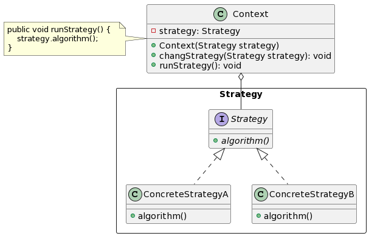
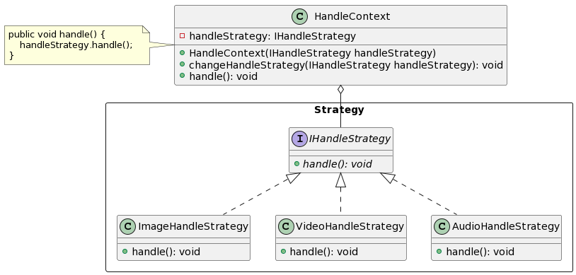
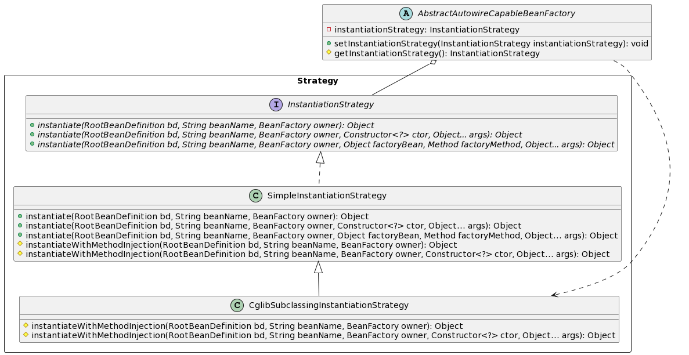

#  策略模式 (Strategy Pattern)

# 0. 简介

**策略（Strategy）模式**的定义：该模式定义了一系列算法，并将每个算法封装起来，使它们可以相互替换，且算法的变化不会影响使用算法的客户。策略模式属于对象行为模式，它通过对算法进行封装，把使用算法的责任和算法的实现分割开来，并委派给不同的对象对这些算法进行管理。
> Wikipedia:
> > In computer programming, the strategy pattern (also known as the policy pattern) is a behavioral software design pattern that enables selecting an algorithm at runtime.

- **应用场景**：
    - 若存在许多相关的类，它们之间的区别仅在于它们的行为，那么策略模式可提供动态选择任一策略来决定其行为，自由切换各个行为
    - 若一个对象有很多行为，使用不当，则可能产生多重条件语句
    - 避免客户端知道复杂的算法策略，将具体算法封装到具体策略类中，简化客户端使用，增加安全性

- **优点**：
    1. 干掉繁琐的 if/else，使用策略模式可避免使用多重条件语句，增加维护性
    2. 提供一系列可供重用的算法族，合理使用继承可将算法族的公共代码转移到父类中，增加重用性，便于管理
    3. 提供了相同行为的不同实现，客户使用端可根据自身需要选择不同的策略
    4. 支持“开闭原则”，可在不修改原代码的情况下，按需灵活增加新算法（策略）
    5. 把算法（策略）的使用放到环境类中，而算法（策略）的实现移到具体策略类中，彼此分离，结构清晰

- **缺点**：
    1. 客户使用端必须理解所有策略算法的区别，以便决定使用何种策略算法
    2. 一定程度上产生了很多的具体策略类，造成策略类膨胀，可考虑函数式接口实现，直接用 lambda 表达式来实现具体策略，可参考 [Arrays.sort() 的 Comparator](#33-jdk-javautilcomparator)
    
# 1. 结构与实现

策略模式的角色如下：
- **抽象策略（Strategy）类**：定义了一个公共接口，各种不同的算法以不同的方式实现这个接口，环境角色（Context）使用这个|接口调用不同的算法，一般使用接口或抽象类实现。
- **具体策略（ConcreteStrategyA, ConcreteStrategyB）类**：实现了抽象策略定义的接口，提供具体的算法实现。
- **环境（Context）类**：持有一个策略类的引用和一个调用策略的公共方法，最终提供给客户端调用。



# 2. 代码示例

> 所有示例代码请参看该包：`com.xixi.lab.dp.ox3_behavioral.ox3_01_strategy`

假使有这样一个需求，我们需处理各种类型的文件（图像、视频、音频 等），且每种类型的文件处理方式不一样，简单实现逻辑无非是使用 if/else 来分别处理，如下：

```java
if ("image".equals(type)) {
    System.out.println("handle image...");
} else if ("video".equals(type)) {
    System.out.println("handle video...");
} else if ("audio".equals(type)) {
    System.out.println("handle audio...");
} else {
    System.out.println("fail to match any type");
}
```

看起来，分支清晰，但实则随着后期业务不断扩充，则会影响维护、不易扩展。由此，可引入策略方式，针对该需求，梳理角色和类图关心如下：

- **抽象策略（IHandleStrategy）接口**：定义了一个公共接口和一个处理方法，具体策略类实现该接口来实现各自的处理逻辑。
- **具体策略（ImageHandleStrategy, VideoHandleStrategy, AudioHandleStrategy）类**：实现了抽象策略接口，各自维护自己的处理策略。
- **环境（HandleContext）类**：持有一个策略类接口和一个调用策略的公共方法，通过初始化该环境类初入具体策略类来设置后续的处理策略。



## 2.1. 普通 Java 版实现

- 抽象策略接口及具体策略实现类：
```java
/**
 * 抽象策略类：文件处理策略
 */
public interface IHandleStrategy {
    /**
     * 针对不同类型的文件，采用不同的处理策略
     */
    void handle();
}

/**
 * 具体策略类：图片处理策略
 */
public class ImageHandleStrategy implements IHandleStrategy {
    @Override
    public void handle() {
        System.out.println("handle image...");
    }
}

/**
 * 具体策略类：视频处理策略
 */
public class VideoHandleStrategy implements IHandleStrategy {
    @Override
    public void handle() {
        System.out.println("handle video...");
    }
}

/**
 * 具体策略类：音频处理策略
 */
public class AudioHandleStrategy implements IHandleStrategy {
    @Override
    public void handle() {
        System.out.println("handle audio...");
    }
}
```

- 环境类：
```java
/**
 * 处理上下文类：
 * 面向策略设计的类，包含策略接口的变量；包含一个委托方法，委托策略变量调用具体实现策略的处理方法
 */
public class HandleContext {

    // 策略接口的变量
    private IHandleStrategy handleStrategy;

    /**
     * 构造函数：接收策略接口的变量
     *
     * @param handleStrategy
     */
    public HandleContext(IHandleStrategy handleStrategy) {
        this.handleStrategy = handleStrategy;
    }

    /**
     * 改变处理策略
     *
     * @param handleStrategy
     */
    public void changeHandleStrategy(IHandleStrategy handleStrategy) {
        this.handleStrategy = handleStrategy;
    }

    /**
     * 委托处理方法，根据构造函数或改变策略方法设置的策略接口的变量，以决定采用何种处理策略
     */
    public void handle() {
        handleStrategy.handle();
    }
}
```

- 客户端调用案例：
```java
/**
 * 测试应用
 */
public class HandleApplication {

    public static void main(String[] args) {
        // 图片处理策略
        HandleContext imageHandleContext = new HandleContext(new ImageHandleStrategy());
        imageHandleContext.handle();

        // 视频处理策略
        HandleContext videoHandleContext = new HandleContext(new VideoHandleStrategy());
        videoHandleContext.handle();

        // 音频处理策略
        HandleContext audioHandleContext = new HandleContext(new AudioHandleStrategy());
        audioHandleContext.handle();
    }
}
```

- 输出结果：
```
handle image...
handle video...
handle audio...
```

## 2.2. Spring Boot 版实现

若是使用 Spring 框架，可直接将各个具体策略类注入到容器中，并通过注入 `Map<String, IHandleSpringStrategy>` 可去 Spring 容器中拿到 key 为 bean id，value 为其对应具体策略实现类对象，从而根据类型（对应 bean id）获取相应的具体策略的对象，再调用自己的处理策略方法即可。

- 抽象策略接口及具体策略实现类：
```java
/**
 * 抽象策略类：文件处理策略
 */
public interface IHandleSpringStrategy {
    /**
     * 针对不同类型的文件，采用不同的处理策略
     */
    String handle();
}

/**
 * 具体策略类：图片处理策略
 */
@Component(HandleSpringContext.IMAGE_STRATEGY_TYPE) // image
public class ImageHandleSpringStrategy implements IHandleSpringStrategy {
    @Override
    public String handle() {
        return "handle image...";
    }
}


/**
 * 具体策略类：视频处理策略
 */
@Component(HandleSpringContext.VIDEO_STRATEGY_TYPE) // video
public class VideoHandleSpringStrategy implements IHandleSpringStrategy {
    @Override
    public String handle() {
        return "handle video...";
    }
}

/**
 * 具体策略类：音频处理策略
 */
@Component(HandleSpringContext.AUDIO_STRATEGY_TYPE) // audio
public class AudioHandleSpringStrategy implements IHandleSpringStrategy {
    @Override
    public String handle() {
        return "handle audio...";
    }
}
```

- 环境类：
```java
@Component
public class HandleSpringContext {

    /**
     * 策略类型
     */
    public static final String IMAGE_STRATEGY_TYPE = "image";
    public static final String VIDEO_STRATEGY_TYPE = "video";
    public static final String AUDIO_STRATEGY_TYPE = "audio";

    /**
     * Spring会自动将IHandleSpringStrategy接口的实现类注入到这个Map中：bean id -> 对应的策略实现类
     */
    @Autowired
    private Map<String, IHandleSpringStrategy> strategyMap;

    /**
     * 委托处理方法，根据构造函数或改变策略方法设置的策略接口的变量，以决定采用何种处理策略
     */
    public String handle(String type) {
        IHandleSpringStrategy handleSpringStrategy = null;
        try {
            // 根据策略类型，从容器中获取相应具体策略实例
            handleSpringStrategy = strategyMap.get(type);
        } catch (BeansException e) {
            e.printStackTrace();
        }
        if (null == handleSpringStrategy) {
            return "获取具体策略处理类失败！";
        }
        return handleSpringStrategy.handle();
    }
}
```

- 定义一个 Controller 来模拟客户端调用：
```java
/**
 * 测试应用
 */
@RestController
public class HandleSpringController {

    @Autowired
    private HandleSpringContext handleSpringContext;

    /**
     * http://localhost:8080/handle?type=image
     * http://localhost:8080/handle?type=video
     * http://localhost:8080/handle?type=audio
     * http://localhost:8080/handle?type=file 异常情况
     *
     * @param type
     * @return
     */
    @GetMapping("handle")
    public String handle(@RequestParam("type") String type) {
        return handleSpringContext.handle(type);
    }
}
```

# 3. 在源码中的应用

## 3.1. Spring源码-org.springframework.core.io.Resource

`org.springframework.core.io.Resource` 接口基于策略模式实现，其实现类 `UrlResource`、`ClassPathResource`、`FileSystemResource` 等提供了各种资源处理方式。

- **抽象策略接口**：
```java
public interface Resource extends InputStreamSource {
    boolean exists boolean exists();    // 返回 Resource 所指向的资源是否存在
    boolean isReadable();   // 资源内容是否可读
    boolean isOpen();   // 返回资源文件是否打开
    URL getURL() throws IOException;
    URI getURI() throws IOException;
    File getFile() throws IOException;  // 返回资源对应的 File 对象
    long contentLength() throws IOException;
    long lastModified() throws IOException;
    Resource createRelative(String var1) throws IOException;
    String getFilename();
    String getDescription();    // 返回资源的描述信息
}
```

- **具体策略类**：
    - `ClassPathResource`：获取类路径下的资源文件
    - `FileSystemResource`：获取文件系统里面的资源
    - `UrlResource`：访问网络资源
    - `ByteArrayResource`：访问字节数组资源
    - `ServletContextResource`：访问相对于 ServletContext 路径里的资源
    - `InputStreamResource`：访问输入流资源

- **获取资源**：
Spring 可通过 `org.springframework.core.io.ResourceLoader` 获取资源，该接口定义了一个获取 `Resource` 的方法 `Resource getResource(String location)`。其实现类有很多，以 `DefaultResourceLoader` 为例，在重写的获取资源的方法中，根据参数 location 来解析判断以决定使用哪个 Resource 的实现类。

```java
public class DefaultResourceLoader implements ResourceLoader {
    // ...

    @Override
	public Resource getResource(String location) {
		Assert.notNull(location, "Location must not be null");

		for (ProtocolResolver protocolResolver : this.protocolResolvers) {
			Resource resource = protocolResolver.resolve(location, this);
			if (resource != null) {
				return resource;
			}
		}

		if (location.startsWith("/")) {
            // 若 location 以“/”开头，则先截取其后的路径，然后采用 ClassPathContextResource
			return getResourceByPath(location);
		}
		else if (location.startsWith(CLASSPATH_URL_PREFIX)) {
            // 若包含“classpath:”前缀，则采用 ClassPathContextResource
			return new ClassPathResource(location.substring(CLASSPATH_URL_PREFIX.length()), getClassLoader());
		}
		else {
			try {
				// Try to parse the location as a URL...
				URL url = new URL(location);
				// 否则，采用 UrlResource
				return new UrlResource(url);
			}
			catch (MalformedURLException ex) {
				// No URL -> resolve as resource path.
				// 若非URL，还是采用 ClassPathContextResource
				return getResourceByPath(location);
			}
		}
	}

    // ...
}
```

## 3.2. Spring源码-org.springframework.beans.factory.support.InstantiationStrategy

`org.springframework.beans.factory.support.InstantiationStrategy` 为抽象策略接口，定义了不同的实例化方法，其实现类 `SimpleInstantiationStrategy` 和 `CglibSubclassingInstantiationStrategy` 实现了具体的实例化策略。在 `AbstractAutowireCapableBeanFactory` 中引用了 `InstantiationStrategy` 变量，从而进行具体的具体的实例化调用。



- **抽象策略接口**：
```java
public interface InstantiationStrategy {

    // 默认构造方法（无参）
	Object instantiate(RootBeanDefinition bd, String beanName, BeanFactory owner)
			throws BeansException;

    // 指定构造函数
	Object instantiate(RootBeanDefinition bd, String beanName, BeanFactory owner,
			Constructor<?> ctor, Object... args) throws BeansException;

    // 指定工厂方法
	Object instantiate(RootBeanDefinition bd, String beanName, BeanFactory owner,
			Object factoryBean, Method factoryMethod, Object... args) throws BeansException;

}
```

- **具体策略实现类** `SimpleInstantiationStrategy`：其中在默认无参构造方法中，针对无 MethodOverride 情况，直接通过反射进行构造函数调用创建实例；而针对有 MethodOverride 情况，通过 `instantiateWithMethodInjection()` 方法处理，此方法在 `CglibSubclassingInstantiationStrategy` 覆盖实现。
```java
public class SimpleInstantiationStrategy implements InstantiationStrategy {

    // 基于默认无参构造函数创建bean实例
    @Override
	public Object instantiate(RootBeanDefinition bd, String beanName, BeanFactory owner) {
		// Don't override the class with CGLIB if no overrides.
		if (bd.getMethodOverrides().isEmpty()) {
    		// 若无 MethodOverride 情况：
			Constructor<?> constructorToUse;
			synchronized (bd.constructorArgumentLock) {
    			// 获取构造函数
				constructorToUse = (Constructor<?>) bd.resolvedConstructorOrFactoryMethod;
				if (constructorToUse == null) {
					final Class<?> clazz = bd.getBeanClass();
					if (clazz.isInterface()) {
						throw new BeanInstantiationException(clazz, "Specified class is an interface");
					}
					try {
						if (System.getSecurityManager() != null) {
							constructorToUse = AccessController.doPrivileged(new PrivilegedExceptionAction<Constructor<?>>() {
								@Override
								public Constructor<?> run() throws Exception {
									return clazz.getDeclaredConstructor((Class[]) null);
								}
							});
						}
						else {
    						// 获取无参构造函数
							constructorToUse =	clazz.getDeclaredConstructor((Class[]) null);
						}
						bd.resolvedConstructorOrFactoryMethod = constructorToUse;
					}
					catch (Throwable ex) {
						throw new BeanInstantiationException(clazz, "No default constructor found", ex);
					}
				}
			}
			// 反射创建bean实例
			return BeanUtils.instantiateClass(constructorToUse);
		}
		else {
    		// 若有 MethodOverride（lookup-method、replaced-method） 情况：使用CGLIB来生成子类
			// Must generate CGLIB subclass.
			return instantiateWithMethodInjection(bd, beanName, owner);
		}
	}
}
```

- **策略使用情况**：初始化了一个  `CglibSubclassingInstantiationStrategy` 的实例化策略变量，后续通过它来调用具体策略。
```java
public abstract class AbstractAutowireCapableBeanFactory extends AbstractBeanFactory
		implements AutowireCapableBeanFactory {

    // 实例化策略变量，初始化为 CglibSubclassingInstantiationStrategy 类型
    private InstantiationStrategy instantiationStrategy = new CglibSubclassingInstantiationStrategy();

    protected InstantiationStrategy getInstantiationStrategy() {
		return this.instantiationStrategy;
	}

    // ...
}
```

## 3.3. JDK源码-java.util.Comparator

^fe565b

`Comparator` 接口有一个 `int compare(T o1, T o2)` 方法，用以实现自定义比较策略，其方法返回值为 `int`，有3种情况：
- o1大于o2，返回正整数
- o1等于o2，返回0
- o1小于o3，返回负整数

这里，`Comparator` 接口作为抽象策略接口，定义了公共的比较方法；`java.util.Arrays` 为环境角色类，其方法 `public static <T> void sort(T[] a, Comparator<? super T> c)`  的第二个参数传递是 `Comparator` 接口的子实现类对象；`Comparator` 接口的子实现类作为具体策略类，覆盖重写 `int compare(Integer o1, Integer o2)` 方法来实现具体的比较策略。

- **抽象策略接口**：
```java
@FunctionalInterface
public interface Comparator<T> {
    int compare(T o1, T o2);

    // ..
}
```

- **使用 `Arrays.sort()` 来实现排序功能**：实现 `Comparator` 接口的 `compare()` 方法，来自定义排序逻辑
```java
Integer[] data = {3, 11, 7, 1, 5};
// 实现升序排序
Arrays.sort(data, new Comparator<Integer>() {
    public int compare(Integer o1, Integer o2) {
        return o1 - o2;
    }
});
System.out.println(Arrays.toString(data));
```

由于 `Comparator` 为函数式接口，亦可通过 lambda 实现自定义比较策略：`Arrays.sort(data, (o1, o2) -> o1 - o2);`

- `Arrays.sort()` 源码如下，从 `TimSort.sort()` 到 `countRunAndMakeAscending()` 可以看到其第二个参数 `Comparator<? super T> c` 只用到了 `compare()` 方法，故而 `Arrays.sort()` 在使用时，其第二个参数仅需重写 `compare()` 方法即可，用以实现具体比较策略
```java
public static <T> void sort(T[] a, Comparator<? super T> c) {
    if (c == null) {
        sort(a);
    } else {
        if (LegacyMergeSort.userRequested)
            legacyMergeSort(a, c);
        else
            TimSort.sort(a, 0, a.length, c, null, 0, 0);
    }
}

static <T> void sort(T[] a, int lo, int hi, Comparator<? super T> c,
                     T[] work, int workBase, int workLen) {
    assert c != null && a != null && lo >= 0 && lo <= hi && hi <= a.length;

    int nRemaining  = hi - lo;
    if (nRemaining < 2)
        return;  // Arrays of size 0 and 1 are always sorted

    // If array is small, do a "mini-TimSort" with no merges
    if (nRemaining < MIN_MERGE) {
        int initRunLen = countRunAndMakeAscending(a, lo, hi, c);
        binarySort(a, lo, hi, lo + initRunLen, c);
        return;
    }

    /**
     * March over the array once, left to right, finding natural runs,
     * extending short natural runs to minRun elements, and merging runs
     * to maintain stack invariant.
     */
    TimSort<T> ts = new TimSort<>(a, c, work, workBase, workLen);
    int minRun = minRunLength(nRemaining);
    do {
        // Identify next run
        int runLen = countRunAndMakeAscending(a, lo, hi, c);

        // If run is short, extend to min(minRun, nRemaining)
        if (runLen < minRun) {
            int force = nRemaining <= minRun ? nRemaining : minRun;
            binarySort(a, lo, lo + force, lo + runLen, c);
            runLen = force;
        }

        // Push run onto pending-run stack, and maybe merge
        ts.pushRun(lo, runLen);
        ts.mergeCollapse();

        // Advance to find next run
        lo += runLen;
        nRemaining -= runLen;
    } while (nRemaining != 0);

    // Merge all remaining runs to complete sort
    assert lo == hi;
    ts.mergeForceCollapse();
    assert ts.stackSize == 1;
}

private static <T> int countRunAndMakeAscending(T[] a, int lo, int hi,
                                                Comparator<? super T> c) {
    assert lo < hi;
    int runHi = lo + 1;
    if (runHi == hi)
        return 1;

    // Find end of run, and reverse range if descending
    if (c.compare(a[runHi++], a[lo]) < 0) { // Descending
        while (runHi < hi && c.compare(a[runHi], a[runHi - 1]) < 0)
            runHi++;
        reverseRange(a, lo, runHi);
    } else {                              // Ascending
        while (runHi < hi && c.compare(a[runHi], a[runHi - 1]) >= 0)
            runHi++;
    }

    return runHi - lo;
}
```

## 3.4. JDK源码-java.util.concurrent.RejectedExecutionHandler

在多线程场景，我们常用现场池来管理线程，以减缓线程频繁的创建和销毁带来的资源的浪费，线程池底层所依赖的主要是 `ThreadPoolExecutor` 类，其构造函数为：
```java
public ThreadPoolExecutor(int corePoolSize, // 核心线程数量，即使这些线程无任务可执行，亦不会销毁
                              int maximumPoolSize, // 最大线程数量
                              long keepAliveTime, // 当线程池中空闲线程数量超过corePoolSize时，多余的线程会在多长时间内被销毁
                              TimeUnit unit, // keepAliveTime的单位
                              BlockingQueue<Runnable> workQueue, // 任务队列
                              ThreadFactory threadFactory, // 线程工厂
                              RejectedExecutionHandler handler) // 拒绝策略
```

实际上，`RejectedExecutionHandler` 接口即为一个抽象策略接口：
```java
public interface RejectedExecutionHandler {
    // 实现拒绝策略：
    // 何时调用拒绝：没有多余的线程来处理、workqueue满了、抛出异常RejectedExecutionException
    void rejectedExecution(Runnable r, ThreadPoolExecutor executor);
}
```

具体策略的实现类有：
- `DiscardOldestPolicy`：**抛弃最旧**，该策略会丢弃任务队列中最早的一个任务，也就是当前任务队列中最先被添加进去的，马上要被执行的那个任务，并尝试再次提交
- `AbortPolicy`：**中止**，该策略会直接抛出异常，阻止系统正常工作
- `CallerRunsPolicy`：**调用者运行**，若线程池的线程数量达到上限，该策略会把任务队列中的任务放在调用者线程当中运行
- `DiscardPolicy`：**抛弃**，该策略会默默丢弃无法处理的任务，不予任何处理。当然使用此策略，业务场景中需允许任务的丢失

- **环境角色类**：
```java
public class ThreadPoolExecutor extends AbstractExecutorService {

    // 抽象策略接口变量
    private volatile RejectedExecutionHandler handler;

    public ThreadPoolExecutor(int corePoolSize,
                              int maximumPoolSize,
                              long keepAliveTime,
                              TimeUnit unit,
                              BlockingQueue<Runnable> workQueue,
                              ThreadFactory threadFactory,
                              RejectedExecutionHandler handler) {
        if (corePoolSize < 0 ||
            maximumPoolSize <= 0 ||
            maximumPoolSize < corePoolSize ||
            keepAliveTime < 0)
            throw new IllegalArgumentException();
        if (workQueue == null || threadFactory == null || handler == null)
            throw new NullPointerException();
        this.acc = System.getSecurityManager() == null ?
                null :
                AccessController.getContext();
        this.corePoolSize = corePoolSize;
        this.maximumPoolSize = maximumPoolSize;
        this.workQueue = workQueue;
        this.keepAliveTime = unit.toNanos(keepAliveTime);
        this.threadFactory = threadFactory;
        this.handler = handler;
    }

    public void setRejectedExecutionHandler(RejectedExecutionHandler handler) {
        if (handler == null)
            throw new NullPointerException();
        this.handler = handler;
    }

    public RejectedExecutionHandler getRejectedExecutionHandler() {
        return handler;
    }

    final void reject(Runnable command) {
        handler.rejectedExecution(command, this);
    }

    public void execute(Runnable command) {
        if (command == null)
            throw new NullPointerException();
        /*
         * Proceed in 3 steps:
         *
         * 1. If fewer than corePoolSize threads are running, try to
         * start a new thread with the given command as its first
         * task.  The call to addWorker atomically checks runState and
         * workerCount, and so prevents false alarms that would add
         * threads when it shouldn't, by returning false.
         *
         * 2. If a task can be successfully queued, then we still need
         * to double-check whether we should have added a thread
         * (because existing ones died since last checking) or that
         * the pool shut down since entry into this method. So we
         * recheck state and if necessary roll back the enqueuing if
         * stopped, or start a new thread if there are none.
         *
         * 3. If we cannot queue task, then we try to add a new
         * thread.  If it fails, we know we are shut down or saturated
         * and so reject the task.
         */
        int c = ctl.get();
        if (workerCountOf(c) < corePoolSize) {
            if (addWorker(command, true))
                return;
            c = ctl.get();
        }
        if (isRunning(c) && workQueue.offer(command)) {
            int recheck = ctl.get();
            if (! isRunning(recheck) && remove(command))
                // 执行拒绝具体策略
                reject(command);
            else if (workerCountOf(recheck) == 0)
                addWorker(null, false);
        }
        else if (!addWorker(command, false))
            // 执行拒绝具体策略
            reject(command);
    }

}
```

# 参考资料

- [Strategy (java-design-patterns.com)](https://java-design-patterns.com/patterns/strategy/)
- [策略模式（策略设计模式）详解 (biancheng.net)](http://c.biancheng.net/view/1378.html)